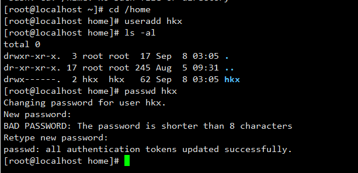
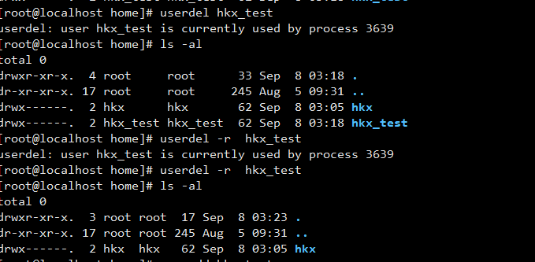
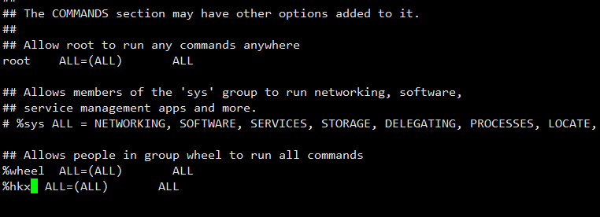
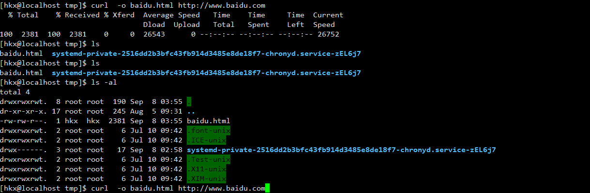
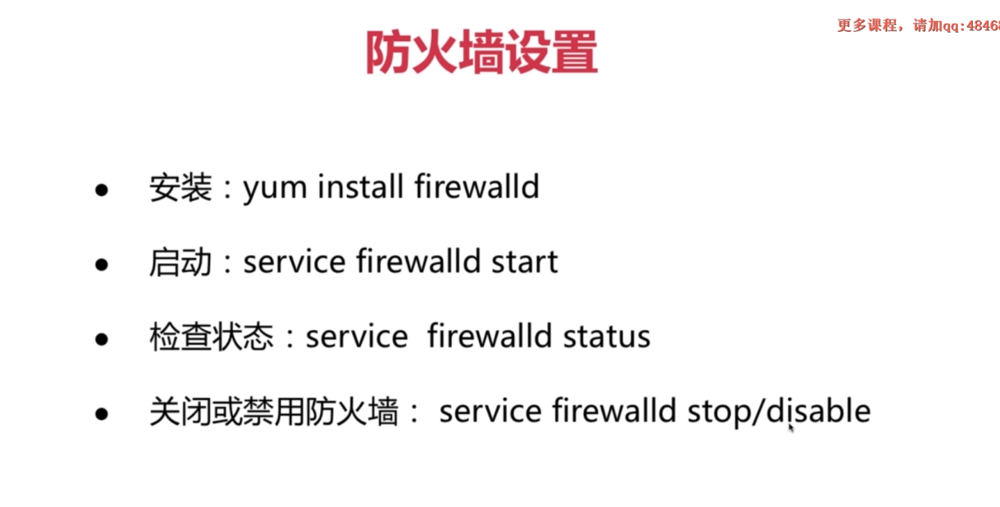
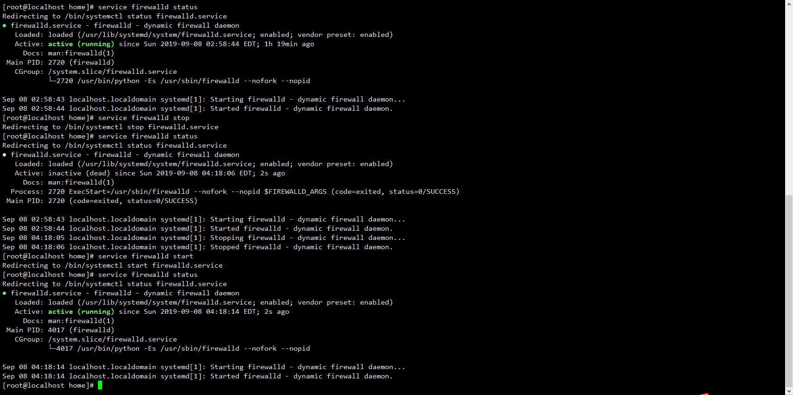

##1 用户基本

正常基本不用 root 账号，它的权限太大了，可能会出现很多问题

- useradd 添加用户
- adduser 添加用户
- userdel 删除用户
- passwd 设置密码

###1.1 增加用户

- 切换到`/home`家目录
- 输入`useradd hkx` 新建 hkx 账号
- 输入`ls -al` 查看文件夹
- 输入`passwd hkx`设置 hkx 账号密码
- 即可用 hkx 账号登录
- 在家目录中,新建的账号只能访问该账号对应的文件夹,访问其他用户的文件夹提示无权限

###1.2 删除用户
在 root 账号下(其他账号删不了)

- 输入`userdel hkx_test`删除用户
- 此时`/home` 文件夹下的 hkx_test 文件夹还存在,使用`rm -rf hkx_test`彻底删除 hkx_test 文件夹
- 还可以使用`userdel -r hkx_test`删除用户的同事删除文件夹

##2 提权和文件上传下载
###2.1 提权 sudo

- 1 使用 hkx 账号登录,`yum install vim`下载 vim 提示报错,要使用 root 权限
- 2 使用`sudo yum install vim`按照提示 hkx 账号不在 sudoers file
- 在 root 账号使用`visudo`命令,编辑`## Allows people in group wheel to run all commands`,将 hkx 账户加入 sudo 中去
- 3 再次使用`sudo yum install vim`即可下载成功

###2.2 文件下载 wget curl

- 输入`wget 资源地址`即可下载资源到当前目录
- 输入`curl -o 指定下载后文件名称 资源地址`,例如`curl -o baidu.html http://www.baidu.com`下载百度首页

###2.3 文件上传 scp
在 linux 系统下,使用 scp 上传文件到服务器

- 使用`scp 文件地址 hkx@192.168.1.4:/tmp`命令,将本地文件上传到服务器 tmp 文件夹
- 使用`scp hkx@192.168.1.4:/tmp/index.text 本地地址`命令,将服务器文件下载到本地地址

###2.4 xshell 上传下载
在 windows 通过 xshell 实现上传下载

- 首先在服务器安装`yum install lrzsz`,
- 下载完毕后 `rz`上传文件到服务器
- `sz 文件名称`将服务器文件下载到本地

## 3 防火墙

centos7 默认安装

## 3.1 查看防火墙

- 使用`yum list |grep firewalld` 查看是否安装
- 使用`ps -ef |grep firewalld`查看防火墙是否运行
- 查看防火墙状态
  

## 3.2 firewall-cmd

- 使用`firewall-cmd --version` 查看版本号
- 使用`firewall-cmd --state` 查看状态
- 使用`firewall-cmd --get-zones firewall-cmd --get-default-zone` 查看所有区域和默认区域
- 使用`firewall-cmd --list-all-zone` 查看所有区域内容
- 使用`firewall-cmd --zone=public --query-service=ssh` 查看 public 区域 ssh 服务
- 使用`firewall-cmd --zone=public --remove-service=ssh firewall-cmd --zone=public --add-service=ssh` 删除 public 区域 ssh 服务,增加 ssh 服务.删除后,通过 xshell 不能连接了
- 使用`firewall-cmd --zone=public --list-services`查看服务

- 使用`firewall-cmd --query-port=22/tcp firewall-cmd --add-port=22/tcp firewall-cmd --remove-port=22/tcp --permanent` 查询,增加,删除端口,没有标明 zone 就指向默认的.
